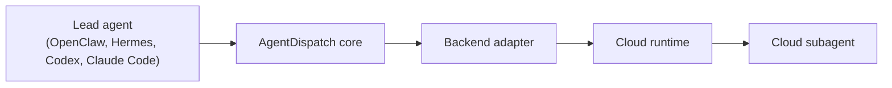

# @agent-dispatch/core

[](https://www.npmjs.com/package/@agent-dispatch/core)
[](https://www.npmjs.com/package/@agent-dispatch/core)

Provider-neutral runtime primitives for AgentDispatch: the MCP control plane that lets a lead agent spawn, monitor, and interact with cloud subagents without binding itself to one cloud API.

## Why this package exists

Agents should not need to know whether a long-running task runs on AWS AgentCore, Cloud Run, Azure Container Apps, Kubernetes, or a local worker. They should ask for a capability, account profile, task type, and target. `@agent-dispatch/core` defines that stable contract and keeps every adapter compatible with the rest of the system.

See the [release workflow](https://github.com/agent-dispatch/core/blob/main/docs/release.md) for the npm publishing workflow and the dependency-order checklist for the separate `agent-dispatch` repositories.



## What core owns

- Provider-neutral models for `Provider`, `Capability`, `AccountProfile`, `Target`, `Task`, `Runtime`, `Session`, `Event`, and `Artifact`.
- Adapter registration and routing by `provider + capability + task_type + target.mode`.
- Durable task lifecycle orchestration with pluggable stores.
- Runtime protocol metadata for A2A, MCP, AG-UI, and HTTP interaction planes.
- Clarification-safe request validation so MCP servers can ask for missing runtime inputs before dispatch.

## Adapter contract

Every provider adapter implements the same shape:

```ts
interface BackendAdapter {
  provider: string;
  capabilities(): AdapterCapability[];
  resolveTarget(request: DispatchRequest): Promise<ResolvedTarget>;
  provision(request: ProvisionRequest): Promise<ProvisionResult>;
  prepareTask?(request: PrepareTaskRequest): Promise<PrepareTaskResult>;
  startTask(request: StartTaskRequest): Promise<StartTaskResult>;
  streamEvents(taskId: string): AsyncIterable<RuntimeEvent>;
  cancel(taskId: string): Promise<CancelResult>;
  cleanup(target: RuntimeTarget): Promise<CleanupResult>;
}
```

Adapters translate provider-neutral requests into provider APIs, then return provider-neutral task handles, events, artifacts, and optional `cloudAgent` metadata. Provider-specific values stay in adapter config or `target.details`; the MCP server and SDK do not import provider SDK types.

## Install

```bash
npm install @agent-dispatch/core
```

## Example

```ts
import { RuntimeService } from "@agent-dispatch/core";

const runtime = new RuntimeService({
  adapters: [awsAgentCoreAdapter],
  store,
  config
});

const task = await runtime.dispatchTask({
  provider: "aws",
  accountProfile: "dev-aws",
  capability: "agent-runtime",
  taskType: "agent.run",
  target: { mode: "session", protocol: "a2a" },
  input: {
    instruction: "Analyze this repository and produce a migration plan."
  }
});
```

## Package role

`@agent-dispatch/core` is the compatibility anchor. All adapters depend on it. It depends on no adapters. If a future provider needs a new feature, the design goal is to extend core once and keep the agent-facing MCP tools stable.

## Development

```bash
npm install
npm run typecheck
npm test
npm run build
```
